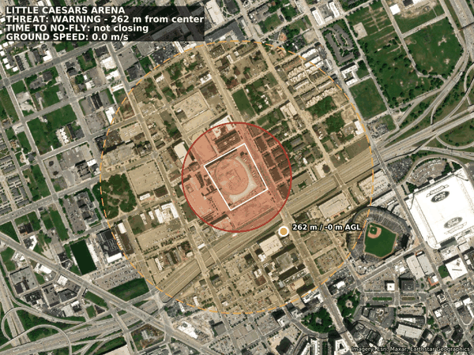

# Counter-UAS Threat Assessment Prototype

A small counter-drone operator display. A simulated drone is tracked live over MAVLink, and its position is checked against layered airspace around a protected site: **Little Caesars Arena, Detroit**. The system renders a georeferenced threat map showing the drone's state, its track and its estimated time to breach.



*A scripted intruder takes off southeast of the arena, runs out to clear airspace, turns inbound, overflies the no-fly zone, exits northwest, then returns home and lands. Playback is 8× real time.*

## What it shows

| Element | Meaning |
|---|---|
| White polygon | Protected asset (arena footprint) |
| Red ring, 200 m | No-fly zone: entry is a **BREACH** |
| Amber dashed ring, 500 m | Warning zone: entry is a **WARNING** |
| Blue line | Drone track (1 Hz breadcrumbs) |
| Marker | Current position, colored by threat state, labeled with distance to the asset and altitude |
| Banner | Threat state, distance, **time to no-fly**, ground speed |

**Time to no-fly** uses the drone's *closing speed*, not its ground speed. Closing speed is the velocity component pointing toward the asset. A drone flying past the site at 15 m/s is "not closing"; one heading straight at it gets a countdown.

Example output from one flight:

```
*** THREAT - -> WARNING (262 m)
*** THREAT warning -> CLEAR (506 m)
*** THREAT clear -> WARNING (487 m, no-fly in 32s)
*** THREAT warning -> BREACH (196 m)
*** THREAT breach -> WARNING (219 m)
*** THREAT warning -> CLEAR (514 m)
```

## Architecture

```
┌──────────────────────┐   MAVLink/UDP 14550   ┌───────────────────────────┐
│ ardupilot-sitl       │ ────────────────────▶ │ src/main.py (host)        │
│ ArduCopter 4.5.7     │ ◀──────────────────── │ - flies scripted route    │
│ + MAVProxy           │   GUIDED setpoints    │ - records telemetry/track │
└──────────────────────┘                       │ - requests map frames     │
                                               └─────────────┬─────────────┘
                                                             │ HTTP GET /map
                                               ┌─────────────▼─────────────┐
                                               │ mapserver (FastAPI)       │
                                               │ - python3-mapscript 7.6   │
                                               │ - threat state + TTB      │
                                               │ - renders PNG             │
                                               └─────────────┬─────────────┘
                                                             │ GDAL WMS/TMS
                                                     Esri World Imagery tiles
```

- **`ardupilot-sitl`** is ArduPilot's software-in-the-loop simulator, with its home position set at the arena.
- **`mapserver`** is MapServer run in-process through its Python bindings (mapscript), not as CGI. The work is split two ways:
  - [`basemap.map`](mapserver/mapfiles/basemap.map) holds **all styling**: zone colors, the three threat-state marker layers and the label overlays.
  - [`app.py`](mapserver/app.py) holds **all geometry**: the asset polygon, the zone rings (drawn as true ground-distance circles, corrected for Web Mercator scale) and the drone and its track. Each is added to an empty layer as an inline feature.
- **`src/main.py`** is the operator-side client. It sends commands to the vehicle and records telemetry. It also requests map frames on a worker thread, so slow tile rendering never stalls the MAVLink connection.

## Link reliability over UDP

MAVLink runs over UDP, so any packet can be lost. Rather than switching to TCP, which would stall fresh telemetry behind retransmissions of stale data, the client adds reliability only where each message needs it:

| Message | Risk if lost | Handling |
|---|---|---|
| Position setpoint (`SET_POSITION_TARGET_GLOBAL_INT`) | Drone never leaves its waypoint | Resent at 2 Hz until telemetry shows arrival within 15 m, with a 180 s deadline |
| Commands (`COMMAND_LONG`) | Mode, arm or stream request silently ignored | Resent every 1 s until `COMMAND_ACK`, `confirmation` counting each resend, up to 5 retries |
| Takeoff | A resend after a lost acknowledgement is refused, because the drone is already climbing | Sent once (`safe_to_retry=False`); success is judged by altitude, not the acknowledgement |
| Parameters (`PARAM_SET`) | Failsafe settings not applied | Resent until a `PARAM_VALUE` echoes the new value |
| GCS heartbeat | The vehicle cannot tell the client has died | Sent at 1 Hz from every wait loop |

Every wait goes through one function, `pump()`, which reads the newest message, sends the heartbeat and keeps the track and map updating. A loop that reads messages on its own falls behind real time and acts on stale positions.

**Failsafe.** Before arming, the client sets two vehicle parameters:
- `SYSID_MYGCS` = 254, its own MAVLink system ID.
- `FS_GCS_ENABLE` = 1, so the vehicle returns home if heartbeats stop.

The vehicle then ignores MAVProxy's heartbeats, which use system ID 255. If the client is killed mid-flight, the vehicle logs `GCS Failsafe` and switches to RTL about 5 s later, even though MAVProxy is still running.

## Running it locally

### Prerequisites

- **Docker** with Compose v2 (Docker Desktop on macOS/Windows)
- **Python 3.10+** on the host
- **Internet access**: the build clones ArduPilot, and the map server downloads imagery tiles
- **UDP port 14550 free** on the host. Close QGroundControl or Mission Planner, since they listen on the same port.

### 1. Clone

```bash
git clone https://github.com/christian4423/counter-UAS-threat-assessment-prototype.git
cd counter-UAS-threat-assessment-prototype
```

### 2. Build and start the containers

```bash
docker compose up -d --build
```

The first build is slow because it compiles ArduPilot from source. On Apple Silicon it is slower still: the SITL image is `linux/amd64` and runs under emulation. Later starts reuse the cached image.

### 3. Check both services

```bash
docker compose ps                      # both containers should be "Up"
curl http://localhost:8080/health      # {"status":"ok"}
```

Open <http://localhost:8080/map> in a browser. You should see the arena, both rings and a marker at the takeoff spot.

The simulator needs about a minute after starting to get a GPS fix. To watch for it:

```bash
docker compose logs -f ardupilot-sitl  # wait for "EKF3 IMU0 is using GPS", then Ctrl+C
```

### 4. Set up the client

```bash
cd src
python3 -m venv .venv
source .venv/bin/activate              # Windows: .venv\Scripts\activate
pip install -r requirements.txt
```

### 5. Fly the intrusion

```bash
python main.py
```

A full flight takes about 6 minutes. While it runs, the console prints a line each time the threat state changes. You can also refresh <http://localhost:8080/map> in the browser while it flies. Press **Ctrl+C** to stop early; the plots and map are still saved.

The script writes its output to `src/`:

- `telemetry_plot.png`: attitude, altitude and ground-speed plots
- `threat_map.png`: final map with the full track
- `threat_map.gif`: animated replay
- `threat_map_frames/`: every full-resolution frame (git-ignored, ~230 MB, cleared each run)

### 6. Stop

```bash
docker compose down
```

To fly again from the pad, run `docker compose up -d`, wait for the GPS fix, then run `python main.py`. Restarting the containers resets the simulated vehicle to its home position.

### Tests

Integration tests run against the live simulator, deliberately dropping or recording outgoing packets to check how the client handles UDP loss. They need the simulator running and UDP 14550 free, so don't run them while `main.py` is flying. Each file takes 10–30 s.

```bash
src/.venv/bin/python tests/test_send_command.py
src/.venv/bin/python tests/test_gcs_link.py
```

`tests/harness.py` loads `main.py`'s functions and MAVLink connection without starting a flight.

**`test_send_command.py`**: command retries

| Test | Checks |
|---|---|
| `test_no_loss` | One send, `confirmation` 0, accepted |
| `test_recovers_after_two_drops` | Resends count `confirmation` 0, 1, 2, spaced ≥ 1 s apart, then accepted |
| `test_gives_up_after_max_retries` | Sends the original plus 5 retries, then raises `TimeoutError` |
| `test_unsafe_command_is_never_resent` | `safe_to_retry=False` sends exactly once and returns `None` on a lost acknowledgement, so the caller can check vehicle state |

**`test_gcs_link.py`**: heartbeat and parameters

| Test | Checks |
|---|---|
| `test_heartbeat_is_about_1hz` | Heartbeats keep flowing through `pump()`, 0.9–1.6 s apart |
| `test_heartbeat_identifies_as_this_gcs` | Heartbeats are `MAV_TYPE_GCS` and sent as system ID 254, not MAVProxy's 255 |
| `test_set_param_confirms_value` | `set_param` returns the value the vehicle echoes back |
| `test_set_param_retries_after_drops` | Two lost `PARAM_SET`s, then success on the third send |
| `test_set_param_unknown_name_times_out` | A parameter the vehicle doesn't have raises `TimeoutError` rather than reporting success |

### Troubleshooting

| Symptom | Cause / fix |
|---|---|
| `main.py` hangs with no "Heartbeat from system" line | No MAVLink is reaching port 14550. Check that `ardupilot-sitl` is up, and that no ground-control app is holding the port. |
| `Arm: Need Position Estimate` repeats | Normal for the first minute after boot. The script retries arming for 90 s; if it gives up, wait and rerun. |
| `Map render failed` in the console, or a black map | The map server can't download imagery tiles. Check its internet access: `docker compose logs mapserver`. |
| Changes to `mapserver/` don't show up | The app and mapfiles are baked into the image. Rebuild with `docker compose up -d --build mapserver`. |

## Map API

`GET http://localhost:8080/map` returns `image/png`. The threat assessment also comes back in headers, so other code can use it without decoding the image.

| Query param | Default | Description |
|---|---|---|
| `lat`, `lon` | takeoff spot | Drone position (WGS84) |
| `track` | none | Past positions, `lat,lon;lat,lon;...` |
| `vn`, `ve` | `0` | Velocity north/east in m/s (used for time to breach) |
| `alt` | none | Altitude above home, in m |
| `width`, `height` | `800`, `600` | Image size in pixels |
| `half_extent_m` | `650` | View half-width around the asset |

Response headers: `X-Threat-State` (`clear` / `warning` / `breach`), `X-Distance-M`, `X-Time-To-Breach-S`.

## Limitations and next steps

- **Cooperative track only.** Position comes from the drone's own telemetry. A real counter-UAS system tracks uncooperative targets from sensors (radar, RF detection, EO/IR cameras), which adds measurement noise. Next steps there are a Kalman-filtered track and a sensor-fusion input.
- **Distance is measured from the asset's center.** It is 2-D and ignores altitude. A polygon-edge distance and an altitude ceiling would be more accurate.
- **Constant-velocity prediction.** Time to breach assumes the drone keeps its current velocity. It does not predict turns.
- **Single asset and single target.** Zones and the asset are constants in `app.py`.

## Credits

Imagery: Esri World Imagery (Esri, Maxar, Earthstar Geographics), used for non-commercial demonstration. Flight simulation: [ArduPilot](https://ardupilot.org) SITL.
